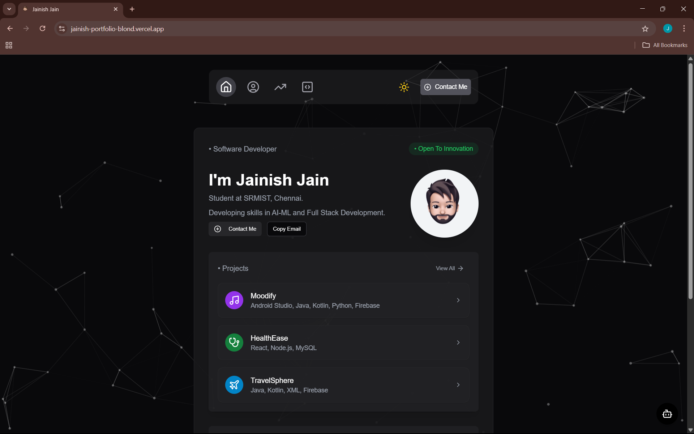

# 🚀 Jainish Jain's Developer Portfolio

[](https://jainish-portfolio-blond.vercel.app/)
[](https://github.com/jainishjain11/portfolio-2.0)
[](#tech-stack)

Welcome to my personal portfolio website! This is where I showcase my journey as a **Software Developer, AI/ML Enthusiast**, and someone who just loves building cool stuff. 🛠️✨

Whether you're here to browse my projects, connect professionally, or see what I’ve been learning lately — you’re in the right place.

---

## 🧠 About Me

Hi, I’m **Jainish Jain**, a Computer Science student at SRM Institute of Science and Technology. I enjoy building apps, experimenting with AI, and playing percussion instruments when I’m not coding.

I’ve built this website to be a **central hub** for everything I’ve worked on, from real-world projects to my latest experiments.

---

## 🗂️ What You’ll Find

- **🔍 Home:** A welcoming hero section with my name, headline, and cool animation.
- **👨‍💻 About:** My education, interests, and what makes me... me.
- **🚀 Projects:** Highlighted work including PillPal, ISTC Seat Portal, and AI-based Microplastic Detection.
- **💼 Experience:** My internship and learning milestones.
- **📞 Contact:** Let’s connect — LinkedIn, GitHub, or even a message.
- **🤖 Jinii Bot:** An interactive chatbot that answers questions about me!!

---


## 🛠️ Tech Stack

**Frontend:**  
- React.js, Next.js  
- Tailwind CSS, Framer Motion  
- Lucide Icons, TypeScript  

**Backend & Tools:**   
- Prisma, Git, GitHub  
- Figma (for UI design)  
- Vercel (for Deployement)
---


## 📸 Sneak Peek



---

## 🤖 Meet Jinii Bot

I’ve added a custom-built chatbot to this portfolio — it answers FAQs about me, including my skills, education, and hobbies! It’s powered by predefined logic and wrapped in a clean UI with Framer Motion animations.

---

## 📬 Contact Me

📧 **Email:** jainishjain.1105@gmail.com  
🔗 **LinkedIn:** [linkedin.com/in/jainish-jain-7364a228a](https://linkedin.com/in/jainishjain11)  
🐙 **GitHub:** [github.com/jainishjain11](https://github.com/jainishjain11)  
📸 **Instagram:** [@jainishjain.11](https://instagram.com/jainishjain.11)

---


## 📌 How to Run Locally

```bash
git clone https://github.com/jainishjain11/portfolio-2.0
cd portfolio-2.0
npm install
npm run dev
